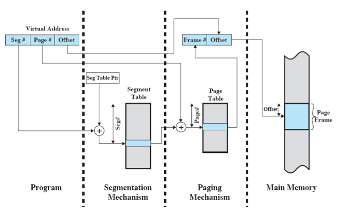

---
authors:
- |
    Craig, Shale\
    `sakcraig@uwaterloo.ca`
title: SE 350 End of Term Notes
...

Memory {#cha:memory}
======

Paging/Segmentation {#sec:paging_segmentation}
-------------------

### Paging {#subsec:paging}

Paging allows memory to be comprised of fixed-size blocks that are
addressed by virtual addresses that are page numbers and an offset. Each
page can be anywhere in main memory.

### Address Translation {#subsec:address_translation}

Address translation (logical, not physical addresses) allow us to use
non-contiguous memory layouts, which allows processes to run without
being fully resident in memory.

Execute code. Once program tries to read/exec instructions not in RAM,
we page fault, block, read data, then resume.

Virtual Addresses are tuples of
${\ensuremath{\left \langle \text{Page \#}, \text{Offset} \right \rangle }}$.
We look up the Page Number + Page Table Pointer in the Page Table, which
gives us the Frame \#. Combine (by a bitmask) the two points, and you
get the physical address of the memory in main memory.

Address Translation (i.e. a root page table) allows us to have large
page tables, and keep some of the page tables in main memory while they
are not being accessed.

The downside of Page Tables is that Page Table size is proportional to
the virtual address space.

### Segmentation {#subsec:segmentation}

Allows the programmer to view memory as multiple address spaces or
segments. We can now share data among processes, and protect segments
from data modification.

Segmentation is pretty much the same as virtual addressing, except the
segment table contains the base address and is added to the offset.

### Combined Paging and Segmentation {#subsec:combined_paging_and_segmentation}

Paging is transparent to the programmer while Segmentation is visible to
the programmer.

See figure [fig:address~t~ranslation~a~nd~s~egmentation] for more
information.

[fig:address~t~ranslation~a~nd~s~egmentation]

Replacement Strategies {#sec:replacement_allocation_strategies}
----------------------

-   Least Recently Used

-   First-in, First-Out

-   Clock Policy

-   Page Buffering

### Page Buffering {#subsec:page_buffering}

Memory pages are cached and are placed into a “free page” or “modified”
page list if they have or haven’t been modified respectively. This is
done so the OS can revive these pages from the list if space becomes
available.

Page Size v.s. Page Faults {#sec:page_size_v_s_page_faults}
--------------------------

By having an smaller page size, all parts of the pages in memory will be
relevant to the process in recent references. If they are bigger, there
will be “useless” portions that aren’t used

Working Set v.s. Resident Set {#sec:working_set_v_s_resident_set}
-----------------------------

Resident set is the portion of a process that is in main memory. The
smaller the resident set size, the higher number of processes that can
be in memory. Once it is past a certain size, there is no real gain from
a large resident set.

The working set is the set of pages of the process that have been
referenced in the last $t$ time.

Calculating the Resident Set Size {#sec:calculating_the_resident_set_size}
---------------------------------

Variable allocation means the size of the working set for one process is
fixed with respect to time. Variable allocation means the size of the
working set for one process varies with respect to time.

There are three main types of allocation strategies:

-   Fixed Allocation, Local Scope:

    Decide before how big the working set should be, then execute under
    that decision.

-   Variable Allocation, Local Scope:

    New processes get a working set size based on a heuristic. Page
    faults result in pages from the current (local) process’s working
    set being kicked out.

-   Variable Allocation, Global Scope:

    New processes get a working set size based on a heuristic. Page
    faults result in pages from any (i.e. global) process’s working set
    being kicked out.

Principle of Locality {#sec:principle_of_locality}
---------------------

Stuff you need in the future is close to stuff you needed in the past.

Simultaneous Execution {#cha:simultaneous_execution}
======================

Preconditions for Deadlock {#sec:preconditions_for_deadlock}
--------------------------

Preconditions for deadlock are as follows:

-   Mutual Exclusion (i.e. no way to ensure processes use resources one
    at a time)

-   Hold-And-Wait

-   No preemption (with respect to resources)

-   Circular wait

Semaphores, Monitors, etc {#sec:semaphores_monitors_etc}
-------------------------

### Mutexes {#subsec:mutexes}

Special machine instructions allow us to test and set a variable in a
single machine instruction (atomically).

                    boolean testSet(int i):
                        if (i == 0):
                            i = 1
                            return true
                        else:
                            return false

                    void exchange(int register, int memory):
                        temp = memory
                        memory = register
                        register = temp
                

This is simple and applicable to any number of processes on single or
multiple processors, but it does busy-waiting and can allow starvation
if there are multiple waiting processes.

### Semaphores {#subsec:semaphores}

Semaphores are special variables that are used for signaling. Semaphores
are initialized to a nonnegative number, generally the maximum number of
concurrent accesses. “semWait” decrements the value, “semSignal”
increments the semaphore value.

                    void semWait(semaphore s):
                        s.count--
                        if (s.count < 0):
                            s.queue.push(getCurrentProcess())

                    void semSignal(semaphore s):
                        s.count++
                        if (s.count <= 0):
                            p = s.queue.pop()
                            p.makeReady()
                

Binary semaphores are the same, but they only take on binary values.

                    void semWaitB(binary_semaphore s):
                        if (s.value == 1):
                            s.value = 0
                        else:
                            s.queue.push(getCurrentProcess())

                    void semSignalB(binary_semaphore s):
                        if (s.queue.isEmpty()):
                            s.value = 1
                        else:
                            p = s.queue.pop()
                            p.makeReady()
                

Amdhal’s Law {#sec:amdhal_s_law}
------------

As the level of Multiprogramming increases, the returns will become
asymptotically faster, but the limit will be constant. This is because
there is a limited set of instructions that can be run at the same time.

Scheduling Algorithms {#sec:scheduling_algorithms}
---------------------

-   Rate Monotonic

    Lower bound on schedulable utilization = 0.693. Highest-priority
    task is the one with the shortest period.

-   Earliest Deadline First:

    Can schedule a CPU utilization of 1. Highest-priority task is the
    one with the next deadline.

Other {#cha:other}
=====

States for Processes {#sec:states_for_processes}
--------------------

-   New

-   Running

-   Ready

-   Blocked

-   Ready-suspend

-   Blocked-suspend

-   Exit
